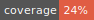

# coverage-badger

This is a fork of [coverage-badger](https://github.com/notnotse/coverage-badger). This is much faster but more locked down method that leverages off pre-downloaded `svgs` instead of downloading from `shield.io` every time. Also fixes some bugs.



Creates a coverage badge by reading the Clover XML coverage report using https://github.com/badges/shields.

* The badge displays appropriate colors for the badge.
* Green: >= 90% overall coverage
* Yellow: 65% <= overall coverage < 90%
* Red: < 65% overall coverage

# Installation

```
npm install --save-dev jest-coverage-shield
```

# NPM Script

coverage-badger can be run as a NPM script.

Example:

```
"scripts": {
  "test": "jest && coverage-shield"
}
```

# CLI

You can now use the CLI to create the badge for a XML Clover report.

The CLI prints the following help:

```
$ ./node_modules/jest-coverage-shield/lib/cli.js

  Usage: cli [options]

  Generates a badge for a given Clover XML report

  Options:

    -h, --help                          output usage information
    -V, --version                       output the version number
    -e, --excellentThreshold <n>        The threshold for green badges, where coverage >= -e
    -g, --goodThreshold <n>             The threshold for yellow badges, where -g <= coverage < -e
    -b, --badgeFileName <badge>         The badge file name that will be saved.
    -r, --reportFile <report>           The Clover XML file path.
    -d, --destinationDir <destination>  The directory where 'coverage.svg' will be generated at.
  Examples:

    $ coverage-badger -e 90 -g 65 -r coverage/clover.xml -d coverage/
      * Green: coverage >= 90
      * Yellow: 65 <= coverage < 90
      * Red: coverage < 65
      * Created at the coverage directory from the given report.
```
